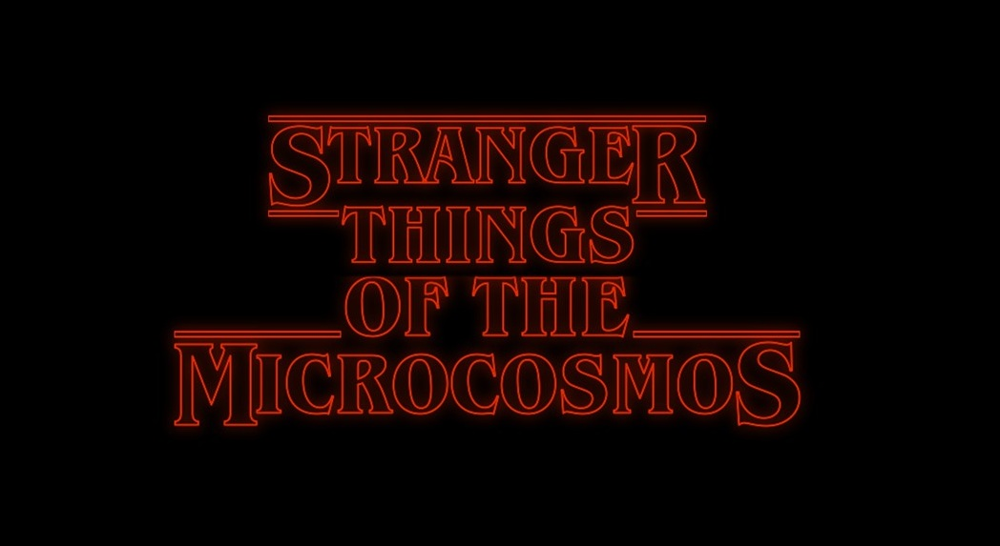

<!-- Google tag (gtag.js) -->

# Teaching in Highschool

## Replicards

Together with Yseult Héjja-Brichard, I developed an interactive class for science teachers to teach biological evolution through a card game.

&#x1F517; <a href="https://replicards.netlify.app/">Replicards website</a>\
&#x1F5A5; <a href="https://github.com/eliamascolo/replicards">Replicards source code</a>

&nbsp; 

## Guest lectures

Guest lectures for high school students (2022 - 2023):
* “Introduction to biology”
* “The logic of transcription and translation”
* “Cells and viruses”
* “Introduction to Genetics” 

# Teaching at the University

## Classes taught

* **General and Molecular Genetics** (BIOL302 - UMBC): Spring 2022, Fall 2023, Spring 2024  
    \> 200 students. Designed weekly homework, held weekly office hours, proctored exams.

* **Ecology and Evolution** (BIOL142 - UMBC): Fall 2021  
    \> 100 students. Prepared and led weekly discussions sections, held weekly office hours, graded and reviewed exams.

* **Advanced Genomics and Epigenomics** (PoliMi-UniMi): Fall 2022  
    Designed, together with Dr. Matteo Brilli, a workshop in R for the class ”Advanced Genomics and Epigenomics”, delivered by the joint PoliMi-UniMi Master’s degree “Bioinformatics for Computational Genomics”.

*   Guest lecture “Motif matching and motif discovery” for the course **Introduction to Bioinformatics and Computational Biology** (BIOL 313 - UMBC): Spring 2022, Spring 2023, Spring 2024

# Science communication

* Invited talk for high school students at *Melzo Incontra la Scienza* (Melzo meets Science)  
“**Evolution of Mutation Rates**” (Jan 2, 2025; Melzo ,Italy)

* Invited talk for Euresis association  
“**Good at evolving – The Evolution of Mutation Rates**” (Aug 20, 2024; Rimini ,Italy)  
&#x1F3AC; [YouTube video](https://youtu.be/-q6mwt5FQmw)  (**in Italian**; starting from min [28:15](https://youtu.be/-q6mwt5FQmw?si=uP9sQgUiDmiPxUEv&t=1695))

* Invited talk at Balticon  
“**Stranger Things of the Microcosmos**” (May 26, 2024; Baltimore, USA)  
&#x1F4C4; [Slides]("./pdf_files/presentations/Elia_Mascolo_Balticon2024_Stranger_Things_of_the_Microcosmos.pdf")  
&#x1F3AC; [YouTube video](https://youtu.be/pdAtQiiDrkI?si=eKJ4Dz2CHKnddyVD)  
&nbsp;

* Invited talk at QuantumPhotonics Club podcast  
“**Viruses may have eyes and ears on us**” (Oct 29, 2022)

* Online presentations for the general public (local cultural associations) during the lockdown in Italy to explain how **COVID-19 vaccines** work and how they are developed (> 100 attendees). (Jan 2021)

  

